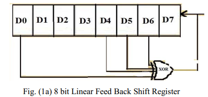
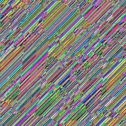
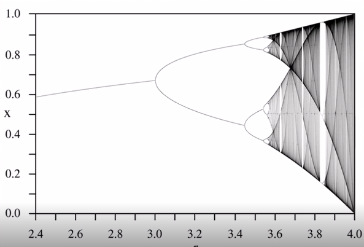
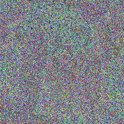

# imageEncryption
image encryption using Chaotic sequence and LFSR method
based on the paper " Image encryption and decryption using chaotic key sequence generated by sequence of logistic map and sequence of states of Linear Feedback Shift Register " by " ROHITH S, K N HARI BHAT, A NANDINI SHARMA"

     1. LFSR
 this method starts with an arbitrary seed and next number generates as shown in this figure     

below is result of using this method

  

    2. Chaotic Sequence
 this method also starts with an arbitrary seed and another parameter mu. the formula that generates the next number is : X(i) = mu * x(i-1) * (1 – x(i-1))

<X(i) = mu * x(i-1) * (1 – x(i-1))>

In this formula mu is between 2 and 4 and when is near to 4 the function generates highly random numbers. Here is how the function behaves

to make the encryption more secure the encryption key is combination of these two methods.

Encryption and Decryption : 
after generating keys using methods above:

encryptedImage = originalImage XOR Key
 
decryptedImage = encryptedImage XOR key
